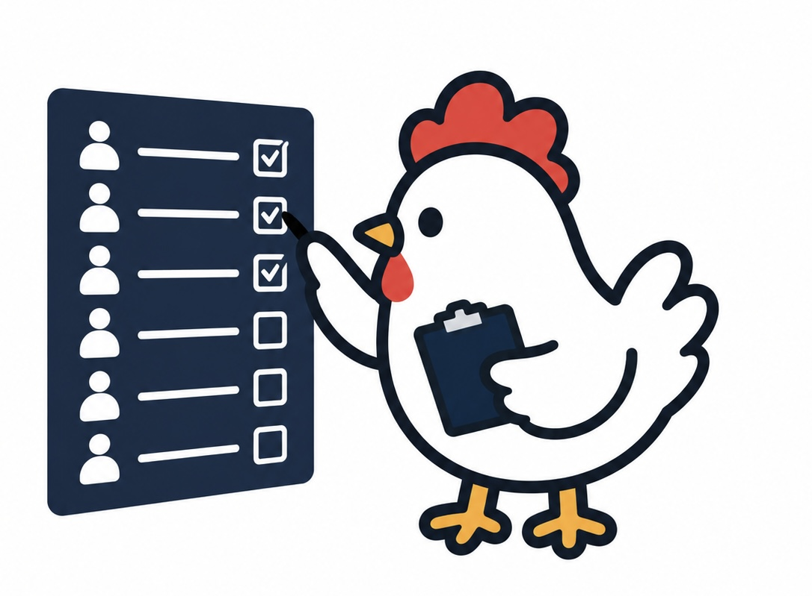
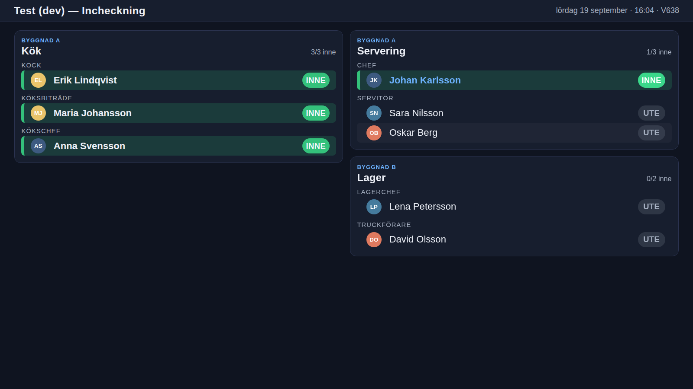
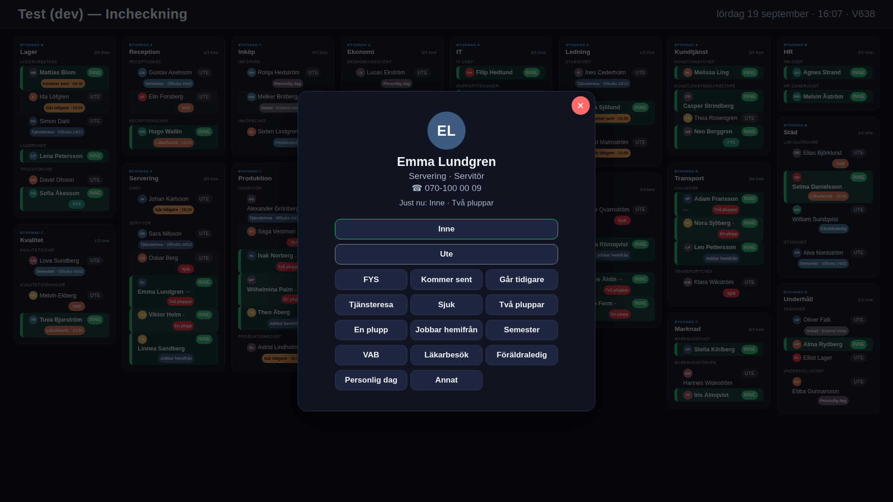
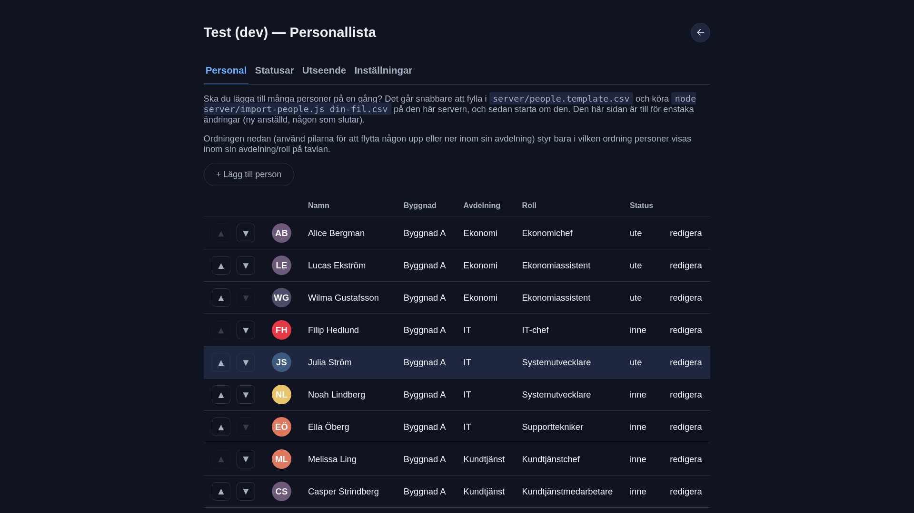

<p align="center">
  
</p>

# CheckinChicken

Offline, LAN-only check-in board. One Node.js server, no external
dependencies, no database, no internet access required. Any number of
screens and coops connect to the same server.

## Screenshots

| Board | Status popup | Admin roster |
|---|---|---|
|  |  |  |

## Requirements

- Node.js >= 14 on the server machine.
- A browser on every screen (any modern browser; kiosk scripts assume
  Chromium).
- No internet access needed at runtime. Node.js itself needs to be
  installed once (see step 2).

## Quick start (local test)

```bash
npm run dev
```

Starts one server on `localhost:9100`, seeded from
`server/people.template.csv` (sample roster split across two sample
coops). Admin passcode: `1234`. Data is written to `dev-data/`
(delete it to reset). `Ctrl+C` to stop.

`board.html` — the board — and `admin.html` — roster/settings — are the
only two pages.

## Setup

### 1. Install Node.js on the server machine

```bash
sudo apt update
sudo apt install -y nodejs
node --version
```

Only the server machine needs Node.js. Screens only need a browser.

### 2. Copy this folder onto the server machine

E.g. to `/home/pi/CheckinChicken`.

### 3. Configure

```bash
cd CheckinChicken
cp config.example.json config.json
```

Edit `config.json`. Fields:

| Field | Default | Notes |
|---|---|---|
| `locationName` | — | Shown in the server's startup log, and as the board's own title. |
| `port` | `8080` | |
| `adminPasscode` | `0000` | Change this. Entered on an on-screen numpad. |
| `allowNameBrowse` | `true` | Unused (reserved). |
| `phoneVisibility` | `"always"` | `"always"` \| `"hash"` \| `"off"` — see [Phone numbers](#phone-numbers). |
| `boardClickToEdit` | `true` | Per-server default; override per screen with `?input=on`/`?input=off`. |
| `theme` | `"dark"` | Seeds `data/theme.json` on first boot only. |
| `popupIdleTimeoutMs` | `300000` | Seeds `data/settings.json` on first boot only. |
| `onscreenKeyboardAdmin` | `false` | Seeds `data/settings.json` on first boot only. |

Coops are not configured here — see
[Multiple coops](#multiple-coops).

Config is read once, at startup. Changing `config.json` requires a
restart (`theme`, `popupIdleTimeoutMs`, `onscreenKeyboardAdmin` are
exceptions after first boot — see the admin page).

### 4. Add people

Edit `server/people.template.csv`. Columns:

```
name,department,role,phone,location,restrictToLocation
```

`name` and `department` are required. `location` is the coop name
(free text, e.g. `Coop A`) — see [Multiple coops](#multiple-coops) for
what a "coop" can represent; leave blank if unused.
`restrictToLocation`: `1`/`true`/`yes`/`ja`/`x` = checked, anything else =
unchecked.

```bash
node server/import-people.js server/people.template.csv
```

Matches existing people by name + department + coop; updates them in
place (status and photo are kept). Never deletes anyone. Safe to re-run.

This writes directly to `data/people.json`. **The running server does not
reload it — restart the server after importing**, or your changes will be
overwritten the next time anyone is edited from the admin page.

Alternative: skip this step and use the admin page (`/admin.html`) after
starting the server.

### 5. Start the server

```bash
node server/server.js
```

Output:

```
[checkin] <locationName> listening on http://0.0.0.0:8080
[checkin] board:  http://<this-machine-ip>:8080/board.html
[checkin] admin:  http://<this-machine-ip>:8080/admin.html
```

To run as a service:

```bash
sudo cp systemd/checkinchicken.service /etc/systemd/system/
sudo systemctl daemon-reload
sudo systemctl enable --now checkinchicken
```

Edit the `WorkingDirectory`/`User` in `checkinchicken.service` first.

### 6. Point every screen at it

```
http://<server-ip>:8080/board.html
```

Same URL for every screen, in every coop. For an unattended kiosk
(fullscreen, no address bar, restarts on reboot), use
`systemd/kiosk-browser.sh` and `systemd/checkin-kiosk-autostart.desktop`
(see comments in those files). Optional URL params:

- `?input=off` / `?input=on` — force this one screen non-touch / touch,
  overriding `config.json`'s `boardClickToEdit`.
- `?location=<coop name>` — pin this screen to one coop (see
  [Multiple coops](#multiple-coops)).

### 7. Manage people later

`http://<server-ip>:8080/admin.html` → enter `adminPasscode`. Add,
edit, or deactivate a person (deactivated people stay in the list, greyed
out, and can be reactivated). Edits apply to every open screen
immediately — no restart needed (this path goes through the live server,
unlike CSV import in step 4).

Roster table sort order: coop, department, `order`, name. ▲/▼
reorders within the same coop + department.

Both the passcode screen and the admin page have a back-arrow button
(top corner) that returns to the board.

## Configuration reference

### Data files (`data/`, created automatically)

| File | Contents |
|---|---|
| `people.json` | Roster + live status, all coops. |
| `statuses.json` | Status menu (admin "Statusar" tab). |
| `theme.json` | Current appearance theme. |
| `settings.json` | Popup idle timeout, admin on-screen-keyboard toggle. |
| `backgrounds.json` | Per-theme background picture + opacity. |
| `backgrounds/` | Uploaded background image files. |

### Environment variables

| Variable | Default | Purpose |
|---|---|---|
| `CHECKIN_CONFIG` | `config.json` | Path to config file. |
| `CHECKIN_DATA_DIR` | `data/` | Path to data directory. |

## Features

### Phone numbers

Optional per-person field. Never shown on the board. Shown on the status
popup per `phoneVisibility`:

- `"always"` — shown immediately.
- `"hash"` — placeholder text, number not sent to the client.
- `"off"` — not shown.

### Profile photos

Optional per-person field, set from the admin page. Resized client-side
to a small square before upload. No photo → colored circle with initials.

### Multiple coops

"Coop" is just this app's name for whatever top-level group you're
splitting people into above department — a building, a floor, a site,
or any other physical location. Use whichever fits: a school might use
one coop per floor, a company with several offices one coop per office,
a single-site team none at all.

- **Field**: `location` (free text, e.g. `Coop A`) on each person, set
  from the admin page or CSV import. Blank = no coop.
- **Sort order**: coop → department → role → name, on both the board
  and the admin roster table.
- **Board filter**: "Alla Coops" (all) or one coop, picked from
  the board's screen-settings popup (tap the clock — see
  [Screen settings](#screen-settings)). Persisted per-device in
  `localStorage` (`checkin:locationFilter`). Hidden there if fewer than 2
  coops are in use. Overridable with `?location=<name>` in the URL
  (also saves to that device).
- **`restrictToLocation`** checkbox (admin page, per person): when set,
  this person is shown only when their own coop is the selected
  filter — hidden from every other coop's view and from "Alla
  Coops". Unset (default): shown everywhere, grouped under their
  coop.

### Statuses (admin "Statusar" tab)

- IN/OUT (`Inne`/`Ute`): fixed, 2 entries, label/color editable only.
- Secondary statuses: up to 16, fully editable (add/rename/recolor/
  delete/reorder). Each can optionally require a time, date, or note; can
  auto-set checked-out; can show 0–3 red dots next to the person's name
  on the board.
- **Date** statuses (e.g. the built-in `Tjänsteresa`/`Semester`) aren't
  limited to a single day — the status popup shows a drawn-to-match
  calendar (Monday-first weeks, with a leftmost week-number column, just a
  prev/next month nav) where tapping a day picks that day and tapping the
  week number picks the whole week, both in the same grid — an admin
  doesn't choose one or the other ahead of time. Picking a week writes `V`
  + the last digit of the ISO week-numbering year + the week number — e.g.
  `V645` for week 45 of a year ending in 6 — same format and ISO 8601 week
  rule (Monday-start, week 1 contains the year's first Thursday) as the
  board's own clock — see [Screen settings](#screen-settings) below.
- **Prefix** (time/date only, optional): prepended to the entered value,
  e.g. `Semester` with prefix `tillbaka` and week `V645` reads "Semester
  · tillbaka V645" on the popup and the board pellet (or "tillbaka 24/12" if
  a day was picked instead).
- A status can't be deleted while assigned to someone.
- Internal code is generated from the label at creation and does not
  change on rename.
- Shared across every screen and coop; no per-location copy.
- `server/statuses.js` seeds `data/statuses.json` on first boot only.

### Appearance theme (admin "Utseende" tab)

Shared across every screen and coop. Built in: `dark` (Mörkt,
default), `light` (Ljust), `christmas` (Jul, includes a snow effect).
`config.json`'s `theme` field only seeds `data/theme.json` on first boot.

To add a theme: add `{ id, label, snow }` to `server/themes.js`, and a
matching `:root[data-theme="<id>"] { ... }` block in `public/shared.css`.

**Background pictures**: per-theme, set from the Utseende tab. Resized
client-side. Stored under `data/backgrounds/`, 3MB max per file. Admin-only
— like the theme itself, this is a server-wide setting (broadcast to every
open screen), so it's never reachable from the board's own screen-settings
popup — see [Screen settings](#screen-settings).

### On-screen keyboard

Shown for free-text fields on a touch device (currently: the "Annat"
status note field). Off by default on the admin page
(`onscreenKeyboardAdmin` setting) since it's normally used with a
physical keyboard.

### Board layout

Board never scrolls or paginates. Column count is chosen automatically to
use the most screen space, not just to fit the department count - fewer,
wider columns are preferred over many narrow ones whenever the screen is
wide enough, so departments can fill the bottom of the screen instead of
only hugging the top row. Text/spacing/avatar size auto-shrink or grow
(within a min/max range) to use the available height, and department
order within a column is alphabetical. Re-evaluates on resize/rotate,
check-in, and admin edits.

The automatic size can be nudged up or down by hand from the screen-
settings popup (see below) if it doesn't land on a good result on its
own — a per-device preference (`checkin:sizeAdjust` in `localStorage`),
60%–160% in 10% steps, "Auto" (100%) by default. The automatic fit still
has the final say either way: turning it down just lets it settle smaller
than it otherwise would, and turning it up only has an effect for as long
as there's genuinely spare room to grow into — it can never force the
board to actually overflow.

### Screen settings

The clock itself (top-right of the board) reads e.g. "torsdag 18
september · 14:32 · V638" — weekday, date, 24-hour time, and the current
ISO 8601 week (`V` + the last digit of the ISO week-numbering year + the
week number, same format used by the `Vecka` status kind — see
[Statuses](#statuses-admin-statusar-tab) above).

Tap the clock to open a popup with:

- **Coop** — same coop filter described under
  [Multiple coops](#multiple-coops) above.
- **Storlek på tavlan** — the manual size nudge described under
  [Board layout](#board-layout) above.
- A button to the real admin page (`admin.html`), which still has its own
  `adminPasscode` gate — this popup itself does not.
- An **i** button next to the close button, top corner — reveals the
  running version (`GET /api/version`, sourced from `package.json`).

Deliberately **client-side only, and deliberately reachable with no
passcode**. Both settings above are per-device (`localStorage`) and never
touch the server at all — there is no server-wide state this popup can
change, which is what makes it safe to leave unlocked. There's no visible
button for it any more either (the board's old header gear icon is gone);
tapping the clock is the only way in, judged enough of a gate for
per-device display settings given this app's threat model (a trusted,
offline LAN, not exposed to the internet — see this file's introduction).

Everything server-wide — theme, background pictures, the roster, statuses,
and every other admin setting — stays admin-only, behind `admin.html`'s
passcode gate, on purpose: a change that would affect every other open
screen too should always require the passcode, not just knowing where the
clock is. This popup's only connection to any of that is its "Adminsidan"
button, which just navigates there.

### Status popup

- Tap a person's IN/OUT badge: toggles directly, no popup.
- Tap anywhere else on their row: opens the status popup (all status
  buttons, department/role, phone number per `phoneVisibility`).
- Time/date fields use a 24-hour HH:MM picker regardless of device
  locale.
- Popup closes on save, or auto-closes after `popupIdleTimeoutMs` of
  inactivity (default 5 min, admin "Inställningar" tab).

### System clock

Admin "Inställningar" tab can set the server machine's clock (no
internet = no NTP), as six +/- stepper fields (HH:MM:SS, YYYY-MM-DD) plus
a Spara button. It calls the server, which runs `date -s` — this only
works if the server PROCESS has permission to change system time, which
a plain `User=pi` systemd service (the default — see
`systemd/checkinchicken.service`) does NOT have. With no preparation,
saving fails with "Servern saknar behörighet…" — this is expected, not a
bug, until one of the two options below is set up.

**Option A — run the service as root.** Simplest, but the server process
then has full root privileges, not just clock access:

```bash
sudo sed -i 's/^User=.*/User=root/' /etc/systemd/system/checkinchicken.service
sudo systemctl daemon-reload
sudo systemctl restart checkinchicken
```

(Or edit the file directly and remove/comment out the `User=` line
entirely — same effect.)

**Option B — grant just the `date` binary permission (recommended).**
Linux capabilities let one specific binary change the system clock
without running as root at all. `date` must be granted the capability as
the REAL file, not the `/usr/bin/date` symlink some distros use:

```bash
sudo apt install -y libcap2-bin   # provides setcap; usually already installed
sudo setcap 'cap_sys_time+ep' "$(readlink -f "$(which date)")"
```

Verify it took:

```bash
getcap "$(readlink -f "$(which date)")"
# expect: .../date cap_sys_time=ep
```

No change to `checkinchicken.service` needed — the existing `User=pi` (or
whichever non-root user) keeps working once `date` itself has the
capability. Trade-off: this grants the capability to `date` system-wide,
so anything on the machine that runs `date -s` (not just this app) can
also now change the clock — a reasonable trade for a single-purpose
offline/kiosk machine, worth knowing about on a shared one.

Either option: restart the server (Option A) or it just works on the
next save attempt (Option B, no restart needed). Test from the admin
page — "Klockan uppdaterad." confirms it worked.

## Troubleshooting

- **Board shows nothing**: confirm `node server/server.js` is running,
  and you're browsing to the server machine's IP, not `localhost` from a
  different device.
- **Connection pill shows "återansluter…"**: live connection to the
  server dropped. Board keeps showing last-known data and reconnects
  automatically.
- **Changed `config.json`, nothing happened**: restart the server —
  config is read once at startup (except `theme`,
  `popupIdleTimeoutMs`, `onscreenKeyboardAdmin`, which are read from
  `data/settings.json`/`data/theme.json` and apply live from the admin
  page).
- **CSV import didn't show up**: restart the server (see step 4).
- **System clock save fails**: server process lacks OS permission to
  change the time — see [System clock](#system-clock).
- **Background picture doesn't show**: check the Utseende tab's opacity
  slider isn't near 0, and that you're on the theme the picture was set
  for.
